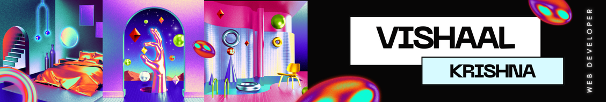

<h1 align="center">
    
</h1>

<h3 align="center">A Web Developer currently pursuing BTech. AIML</h3>

###

  
  
  
 

###

<h2 align="center">⚒️ Languages-Frameworks-Tools ⚒️</h2>
 

    
     

###

<h3 align="center">LinkedIn Profile</h3>

###

  

###

###

 

  <h2>🐍 My Contributions 🐍</h2>
   
  
  
    

 

###

 

<h2 align="center">Trophies</h3>

###

  

 

###

<!--  

 -->

###

  

 

###

 

<h2 align="center">Featured Projects</h3>

###

###

<strong>Smart India Hackathon 2023 Project :</strong> Bharat HydroVision - An Underwater ROV for Dam Inspection     

###
 

###

###

<strong>Google Solution Challenge 2024 :</strong>   Memento - A Marketplace for Rural Artisans     <!--  -->

###
 

###

###

<strong> EyeTalk</strong> - An Assistive Technology for ALS and Paralyzed Patients     

###

